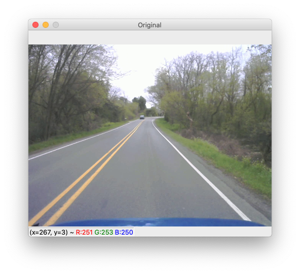
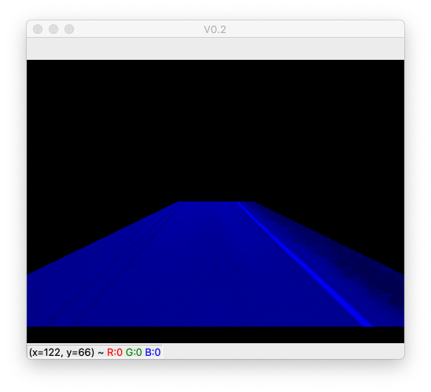
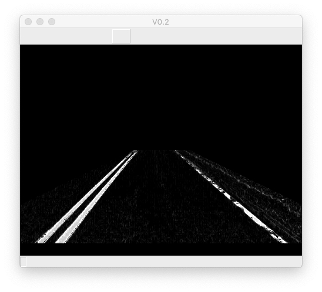
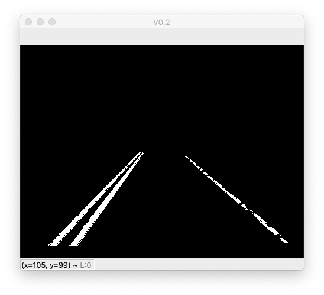
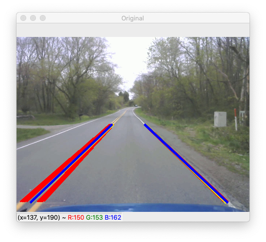

# AutonoMas
 Lane Detection Algorithm
 
## Setup
1. Clone the repository
2. Insure you have python3.x installed
3. If you have pip run '''bash
pip install -r requirements.txt 
'''
this will install the required python modules
4. next go to the end of the autonomas.py file and set the path to the video you which to use (line 309)
5. Now you should be able to run the program, enjoy!
 
## How it works
The algorithm uses 8 filters and functions to detect lane lines.
1. The image is masked to only have the road in the image
2. HSL color threhold
3. Gray Scale color threshold
4. Sobel Filter used on x and y
5. Canny Edge Detection
6. Adaptive Binary Filter
7. Hough Lines Filter
8. Extapolation and averaging of Hough Lines 
9. Moving average for Extapolation Lines

Orginal Image

Masked Image

Filtering (Color HSL and Gray Scale, Sobel, and Canny Edge Detection)

Filtering Adaptive Binary Threshold

Resulting Image

## Conclusions

## Aknowledgements
